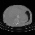

# CT-Scan-Classification

Machine learning project meant to classify CT Scans. The first approach uses Random Forests, while the second uses Transfer Learning, starting from EfficientNet-B0. 

### Data Samples  

 

### Confusion Matrix
#### Random Forests
#### Convolutional Neural Network
